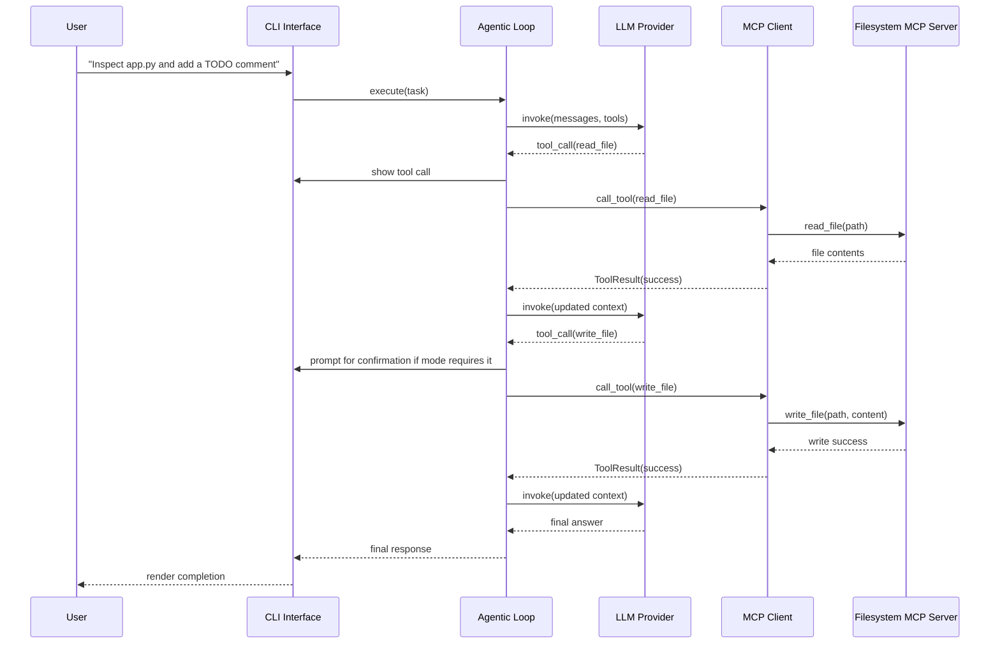
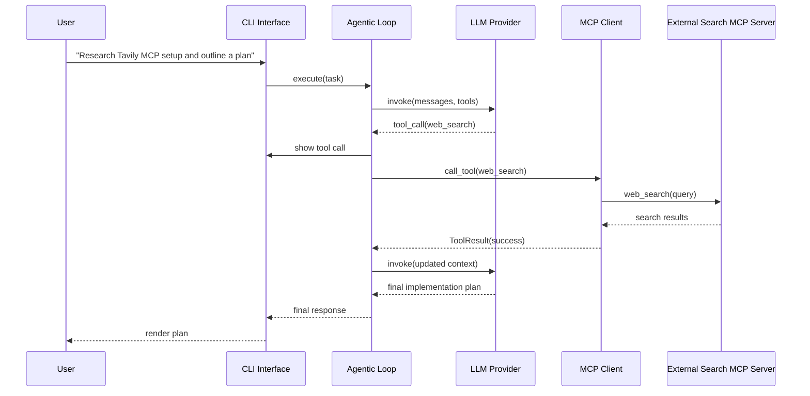
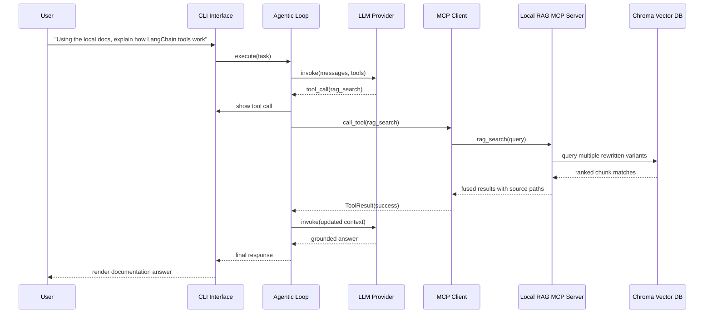
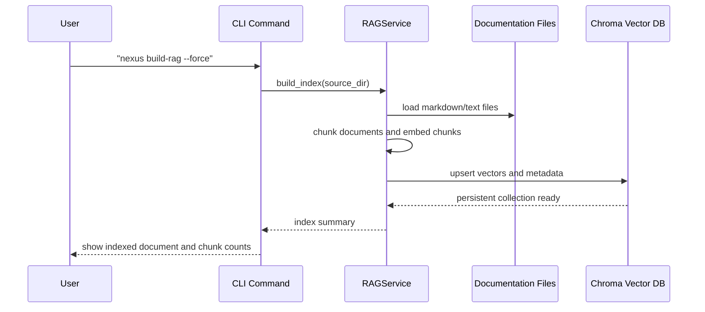

# Sequence Diagrams

These diagrams show the interactions the assignment asks us to document between the user, CLI, agent loop, LLM, MCP client, and MCP servers.

## Scenario 1: Read and Edit a File

## Scenario 2: Search the Web and Produce a Plan

## Scenario 3: Build and Use the Local Documentation Index

## Scenario 4: Initial RAG Index Build

