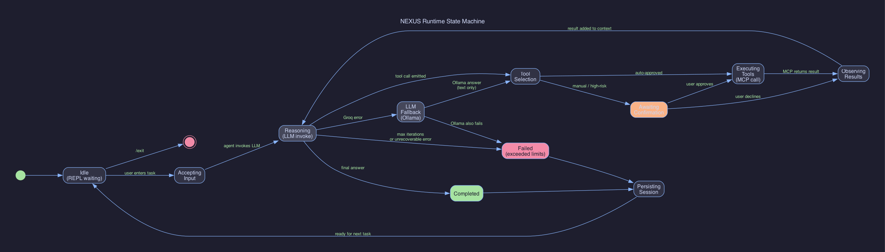
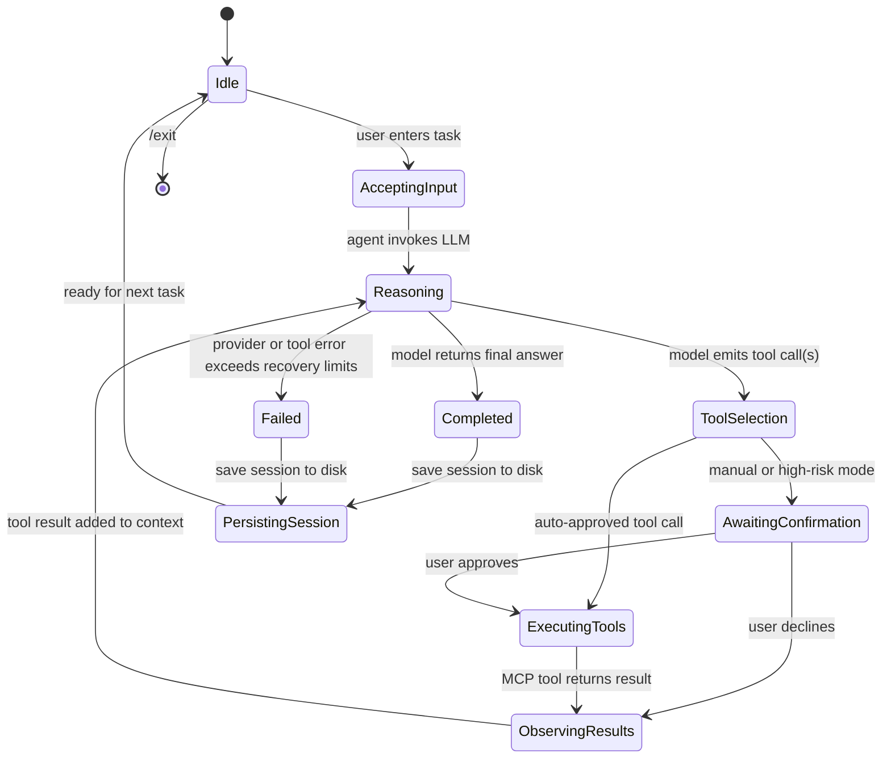

# State Diagram

The state machine below captures the runtime behavior of the CLI assistant from a single user turn through completion.

The rendered PNG above is generated by `scripts/generate_diagrams.py`. The Mermaid source below is the canonical reference and renders directly on GitHub.

## Notes

- The `ObservingResults` state covers both success and failure. Tool failures still become model context so the agent can recover or explain what happened.
- Confirmation is only a distinct state when the current execution mode demands it.
- Persistence happens on shutdown so work can be resumed with `--session`.
