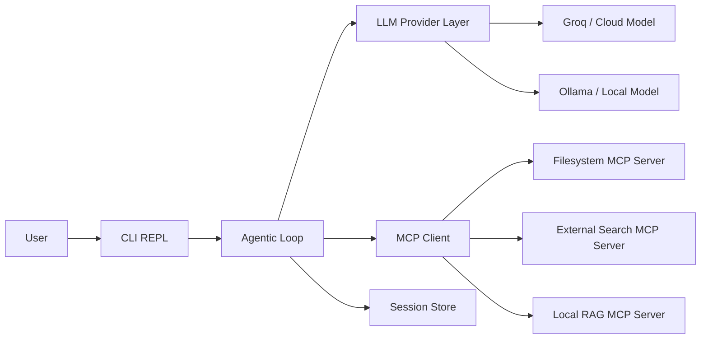
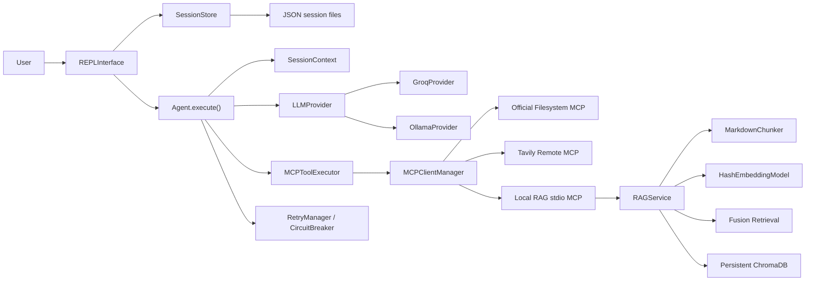

# System Spec

## Goal

NEXUS is a command-line coding assistant that behaves like an autonomous agent rather than a chatbot. The user provides a task once, and the system keeps reasoning, invoking tools, observing results, and continuing until it finishes or reaches a safe stopping condition.

## Original Planning Architecture

## Updated Implementation Architecture

## What Changed

- The MCP layer was split into `MCPClientManager` and `MCPToolExecutor` so discovery and execution are isolated and testable.
- The filesystem integration now uses the official `@modelcontextprotocol/server-filesystem` package instead of only a local placeholder server.
- The custom local RAG MCP server is now implemented and loaded dynamically alongside the other MCP servers.
- The local RAG subsystem persists an index to disk so documentation only needs to be ingested once.
- The REPL acts as the interaction handler for tool visibility and confirmation prompts.

## Runtime Rules

- The LLM provider decides whether to answer directly or request tools.
- The session stores user turns, assistant turns, tool calls, and tool results.
- The agent loop continues until the model returns a final answer or the iteration cap is reached.
- Execution mode controls confirmations:
  - `auto`: execute every tool automatically
  - `manual`: confirm every tool
  - `confirmation`: confirm only higher-risk tools
- The local RAG server uses:
  - markdown-aware chunking
  - deterministic local embeddings
  - query rewrites
  - reciprocal rank fusion
  - persistent ChromaDB storage

## Assignment Checklist

Implemented in this repo:

- Agentic loop
- Provider abstraction for Ollama and a cloud provider
- CLI REPL with visible tool activity and confirmation modes
- Dynamic MCP tool discovery
- Official filesystem MCP server
- External resource MCP server
- Custom local RAG MCP server
- Advanced RAG technique in code
- Persistent sessions
- Planning and deliverable docs

Operational note:

- The live external MCP demo path requires a valid `TAVILY_API_KEY`.
